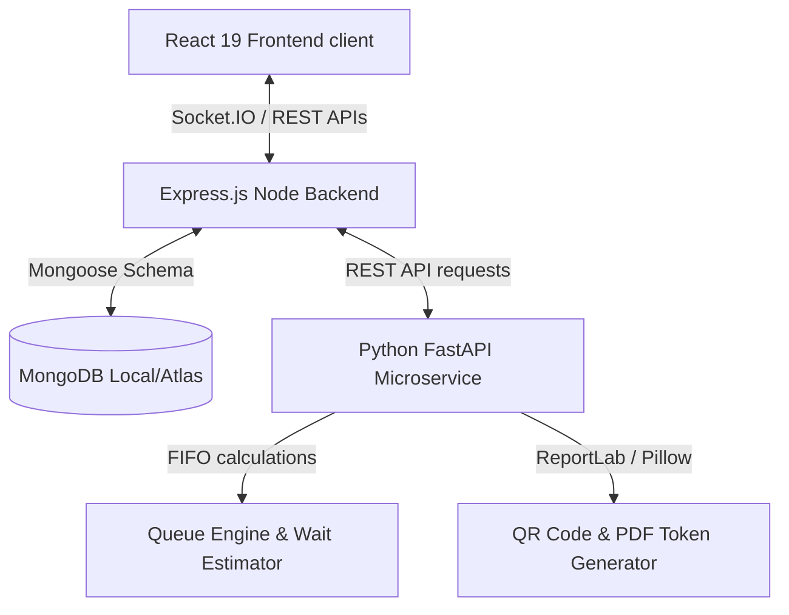

# QueueLess ⏳

> **Smart Digital Queue & Appointment Management Platform**
> A production-ready MERN + Python FastAPI digital queuing solution designed to eliminate physical waiting lines in clinics, hospitals, banks, salons, government offices, and local retail stores.

---

## 🚀 Key Features

### 👤 Customer Experience
* **Search & Browse:** Live searching of local businesses by name or category.
* **Join Queue Remotely:** Generate digital queue ticket tokens with local service duration calculations.
* **Dynamic Wait Time Estimator:** View live position queue counters and calculated wait times.
* **Offline Access:** Scan dynamic QR codes or download ReportLab PDF ticket certificates.
* **Manage History:** Complete dashboard log detailing past ticket statuses.

### 💼 Business Owner Controls
* **Live Console:** Counter dashboard to "Call Next Customer", "Skip", or mark "Complete".
* **Service Configurations:** CRUD panel to create services with customized duration estimates.
* **Live Dashboards:** Real-time Socket.IO synchronization on queue counter increments.
* **Analytics Insights:** Area charts for peak customer traffic hours and service breakdowns (pie/bar).

### 🛡️ Admin Suite
* **Accounts Review:** List all user registration details and categories.
* **Suspension Flags:** Instantly freeze/activate any business profile on the platform.

---

## 🛠️ Tech Stack & Architecture



### Frontend (`client/`)
* **React 19** & **Vite** (TypeScript template)
* **Tailwind CSS** (Glassmorphism design language)
* **Recharts** (Peak traffic area charts & service logs)
* **Socket.IO Client** (Real-time queue tracking subscriptions)

### Backend (`server/`)
* **Node.js** & **Express.js** (Core API Server)
* **Mongoose** (MongoDB schemas and database indexing)
* **Socket.IO** (Real-time updates broadcast engine)
* **Helmet & CORS** (Security protocols)
* **bcryptjs & jsonwebtoken** (Secure credentials hashing and JWT verification)

### Python Microservice (`python-service/`)
* **FastAPI** (Fast asynchronous Python API framework)
* **ReportLab** (Programmatic PDF token sheet generation)
* **qrcode & Pillow** (Dynamic QR code rendering)
* **Pydantic v2** (Strict data parsing & model assertions)

---

## 📋 Database Collections (Mongoose Models)

1. **Users:** Handles system authentication roles: `customer`, `business_owner`, `admin`.
2. **Businesses:** Registers location, contact numbers, hours, active state, and owner reference.
3. **Services:** Tracks service lists per business along with their estimated base duration (minutes).
4. **Queues:** Regulates current daily ticket counts (`currentTokenNumber`, `lastTokenNumber`) matching dates.
5. **Tokens:** Tracks queue tickets status: `waiting`, `called`, `completed`, `skipped`, `cancelled`, `expired`.
6. **Notifications:** Stores text notifications pushed to users' logs.

---

## ⚡ Setup & Installation

### Prerequisites
* **Node.js** (v18+ recommended)
* **Python** (v3.9+ recommended)
* **MongoDB** (Local instance running on `localhost:27017` or Atlas cloud connection string)

---

### Step 1: Configure Database & Seed Test Data
1. Navigate to the `server` directory:
   ```bash
   cd server
   ```
2. Setup environment variables by copying `.env.example`:
   ```bash
   copy .env.example .env
   ```
3. Install dependencies:
   ```bash
   npm install
   ```
4. Seed the database (creates admin, customer, owner roles, businesses and queue history):
   ```bash
   npm run seed
   ```

---

### Step 2: Launch Python FastAPI Microservice
1. Navigate to the `python-service` directory:
   ```bash
   cd ../python-service
   ```
2. Install Python dependencies:
   ```bash
   pip install -r requirements.txt
   ```
3. Start the FastAPI server using uvicorn:
   ```bash
   python main.py
   ```
   *The Python microservice will run on: `http://127.0.0.1:8000`*

---

### Step 3: Launch Express Backend Server
1. Return to the `server` directory:
   ```bash
   cd ../server
   ```
2. Start the development server:
   ```bash
   npm run dev
   ```
   *The Express server will run on: `http://localhost:5000`*

---

### Step 4: Run Vite React Frontend
1. Navigate to the `client` directory:
   ```bash
   cd ../client
   ```
2. Install dependencies:
   ```bash
   npm install --legacy-peer-deps
   ```
3. Run the Vite local development server:
   ```bash
   npm run dev
   ```
   *Open browser to: `http://localhost:5173`*

---

## 🧪 Seeding & Test Credentials

After running the seed script (`npm run seed`), use these credentials to log in and test:

* **Customer Account:**
  * **Email:** `customer1@queueless.com`
  * **Password:** `customer123`
* **Business Owner Account:**
  * **Email:** `hospital@queueless.com` (City General Hospital) OR `bank@queueless.com` (Apex Bank)
  * **Password:** `owner123`
* **Super Admin Account:**
  * **Email:** `admin@queueless.com`
  * **Password:** `admin123`

## 🎭 Demo Mode (no backend)

Production builds without `VITE_API_URL` (e.g. the Vercel deployment) run in demo mode: an in-browser mock API serves dummy shops, accounts and queue history saved in `localStorage`, so the full customer, vendor and admin flows work without the Express server, MongoDB or the Python service. The same test credentials above work except `bank@queueless.com` (the demo has no bank), plus `salon@`, `clinic@`, `restaurant@`, `govt@`, `service@` and `retail@queueless.com` (password `owner123`). Use **Reset demo** in the top banner to restore the starting data.

Set `VITE_DEMO_MODE=true` or `false` to force demo mode on or off.
